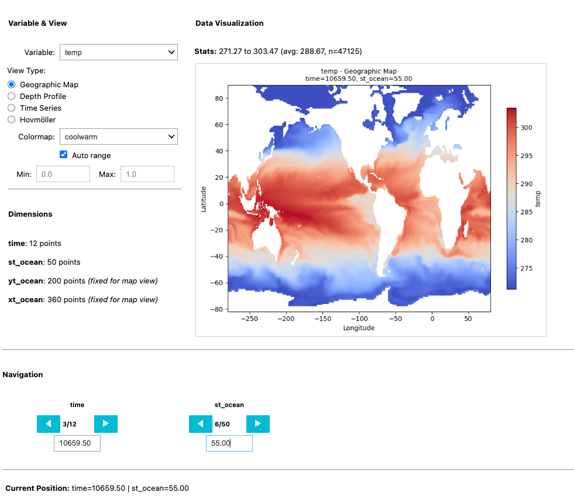

# PyView - Interactive NetCDF Viewer for Jupyter

A Python-based interactive netCDF viewer designed for Jupyter notebooks. Provides ncview-like functionality optimized for remote server usage.



## Features

- **Four Plot Types**: Geographic maps, depth profiles, time series, Hovmöller diagrams
- **Smart Navigation**: Previous/Next buttons with coordinate values and wrap-around
- **Real-time Statistics**: Automatic min/max/mean updates and valid cells
- **Theme Support**: Light and dark mode themes
- **Manual Color Range**: Text-based range inputs for precise control
- **Smart Validation**: Only shows valid plot types based on data dimensions

## Quick Start

```python
from pyview import pyview

# Open your netCDF file
viewer = pyview('your_file.nc')
```

## Installation

### Automated Setup
```bash
# Clone or download the PyView repository
git clone https://github.com/your-repo/pyview.git
cd pyview

# Run the automated setup script
bash setup_env.sh

# Activate the environment
conda activate pyview
```

### Manual Setup
```bash
# Core dependencies
pip install xarray matplotlib ipywidgets numpy netcdf4

# For Jupyter Lab
jupyter labextension install @jupyter-widgets/jupyterlab-manager
```

## Usage Examples

```python
# Basic usage
viewer = pyview('your_file.nc')

# With dark theme
viewer = pyview('your_file.nc', dark_mode=True)

# Custom dimension mapping
viewer = pyview(file_path,
                dark_mode=False,
                dim_mapping={
                    'lat': 'yt_ocean',
                    'lon': 'xt_ocean',
                    'depth': 'st_ocean'
                    })

# Show detected dimensions
viewer.show_dimension_mapping()
```

## Contributing

PyView is designed to be sxtensible and contribution-friendly:
- Additional Plot Types: 3D visualization, vector plots, multi-panel dispalys
- Enhanced Statistics: Histograms, spatial correlations
- Export Features: Animations, data subsets, publication formats
- Performance_: Optimization for very large datasts, parallel processing
- Format Support: Additional file formats

## Licence

MIT Licence - Open source and free for all scientific use.

## Author

Urs Hofmann Elizondo

## Acknowledgments

This repository is inspired by the ncview tool by David W. Pierce, and extended with the feedback of the Ocean Modelling and Global Biogeochemical Modelling groups at the University of Bern
